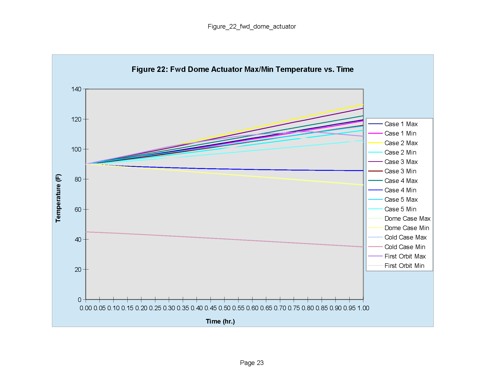
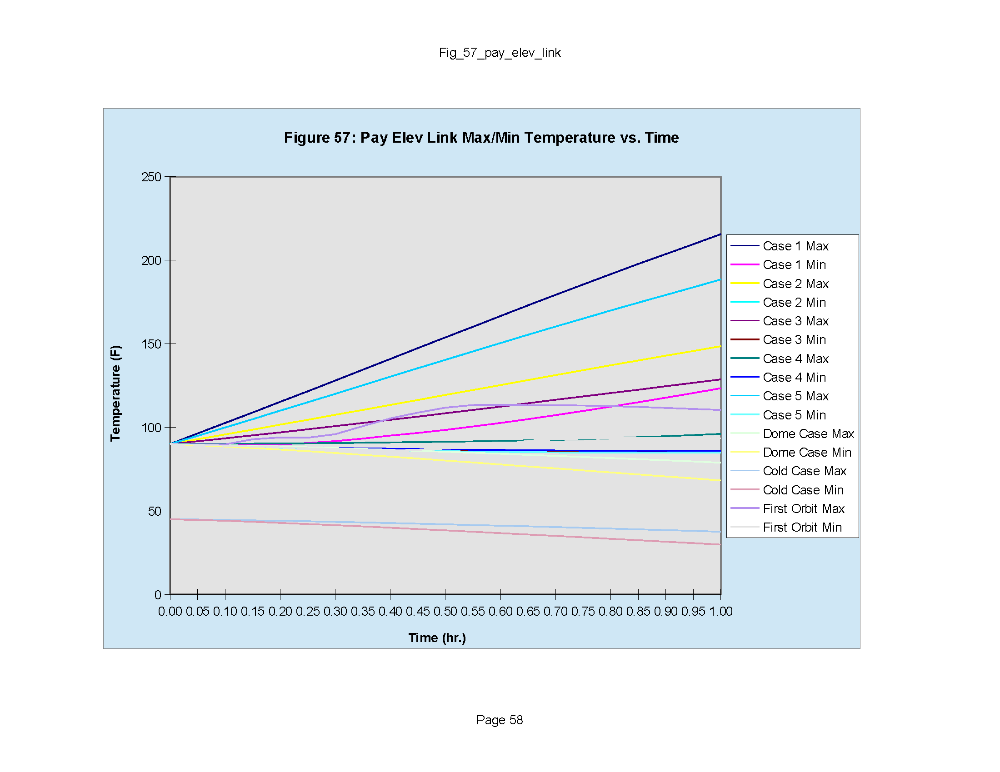

# ========================================
# OV Orbital Injection and Payload Deployment Transient Thermal Analysis:
# ========================================

## OV Orbital Injection and Payload Deployment Transient Thermal Analysis using SindaG.

##
## I. Table 1: PRELIMINARY Simplified Payload Bay Thermal Analysis Results:

##

##

##

##

##

## II. SindaG Input Files:
### IIa. "./preprocessor/OV_on_orbit_k.sin"
### IIb. "./preprocessor/sinda.TP2"
### IIc. "./preprocessor/sinda.TP4"

## III. SindaG Operation: "./bin/OV_on_orbit_k.exe"

## IV. SindaG Results Output: "./output/OV_on_orbit_k.out"

## 
## *Note: 
## 1. Thermal Analysis performed using SINDA-G, ( http://www.mscsoftware.com/product/sinda )

